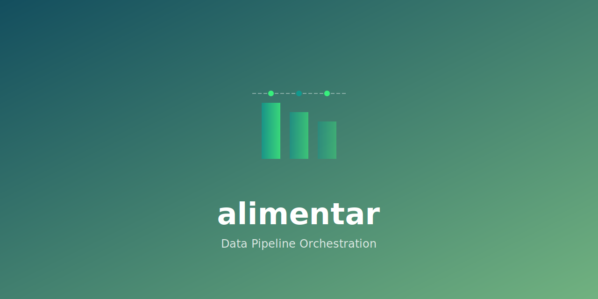

<div align="center">

<p align="center">
  
</p>

<h1 align="center">alimentar</h1>

<p align="center">
  <b>Data Loading, Distribution and Tooling in Pure Rust</b>
</p>

<p align="center">
  <a href="https://crates.io/crates/alimentar"></a>
  <a href="https://docs.rs/alimentar"></a>
  <a href="https://github.com/paiml/alimentar/actions/workflows/ci.yml"></a>
  <a href="https://github.com/paiml/alimentar/actions/workflows/coverage.yml"></a>
  <a href="https://github.com/paiml/alimentar/actions/workflows/security.yml"></a>
  <a href="https://opensource.org/licenses/MIT"></a>
  <a href="https://github.com/paiml/alimentar/blob/main/SECURITY.md"></a>
</p>

<p align="center">
  <i>A sovereignty-first data loading library for the paiml AI stack. Provides HuggingFace-compatible functionality with local-first design.</i>
</p>

</div>

## Table of Contents

- [Features](#features)
- [Installation](#installation)
- [Quick Start](#quick-start)
- [Examples](#examples)
  - [Apply Transforms](#apply-transforms)
  - [Import from HuggingFace](#import-from-huggingface)
  - [Use S3 Backend](#use-s3-backend)
  - [Streaming Large Datasets](#streaming-large-datasets)
- [Feature Flags](#feature-flags)
- [CLI Usage](#cli-usage)
- [Architecture](#architecture)
- [Performance](#performance)
- [Quality Standards](#quality-standards)
- [Citation](#citation)
- [License](#license)
- [Related Projects](#related-projects)

## Features

- **Zero-copy Arrow**: All data flows through Arrow RecordBatches for maximum performance
- **Multiple backends**: Local filesystem, S3-compatible storage, HTTP/HTTPS sources
- **HuggingFace Hub**: Import datasets directly from HuggingFace
- **Streaming**: Memory-efficient lazy loading for large datasets
- **Transforms**: Filter, sort, sample, shuffle, normalize, and more
- **Registry**: Local dataset registry with versioning and metadata
- **Data Quality**: Null detection, duplicate checking, outlier analysis
- **Drift Detection**: KS test, Chi-square, PSI for distribution monitoring
- **Federated Learning**: Local, proportional, and stratified dataset splits
- **Built-in Datasets**: MNIST, Fashion-MNIST, CIFAR-10, CIFAR-100, Iris
- **WASM support**: Works in browsers via WebAssembly

## Installation

Add to your `Cargo.toml`:

```toml
[dependencies]
alimentar = "0.2"
```

With specific features:

```toml
[dependencies]
alimentar = { version = "0.1", features = ["s3", "hf-hub"] }
```

## Quick Start

```rust
use alimentar::{ArrowDataset, Dataset, DataLoader};

// Load a Parquet file
let dataset = ArrowDataset::from_parquet("data/train.parquet")?;
println!("Loaded {} rows", dataset.len());

// Create a DataLoader for batched iteration
let loader = DataLoader::new(dataset)
    .batch_size(32)
    .shuffle(true);

for batch in loader {
    // Process Arrow RecordBatch
    println!("Batch has {} rows", batch.num_rows());
}
```

## Examples

### Apply Transforms

```rust
use alimentar::{ArrowDataset, Dataset, Select, Filter, Shuffle};
use alimentar::Transform;

let dataset = ArrowDataset::from_parquet("data.parquet")?;

// Select specific columns
let select = Select::new(vec!["id", "text", "label"]);
let dataset = dataset.with_transform(Box::new(select));

// Shuffle with a seed for reproducibility
let shuffle = Shuffle::with_seed(42);
```

### Import from HuggingFace

```rust
use alimentar::hf_hub::HfDataset;

let dataset = HfDataset::builder("squad")
    .split("train")
    .build()?
    .load()?;
```

### Use S3 Backend

```rust
use alimentar::backend::{S3Backend, StorageBackend};

let backend = S3Backend::new(
    "my-bucket",
    "us-east-1",
    None, // Use default endpoint
)?;

let data = backend.get("datasets/train.parquet")?;
```

### Streaming Large Datasets

```rust
use alimentar::streaming::StreamingDataset;

// Load in chunks of 1024 rows
let dataset = StreamingDataset::from_parquet("large_data.parquet", 1024)?;

for batch in dataset {
    // Process without loading entire file into memory
}
```

## Feature Flags

| Feature | Description | Default |
|---------|-------------|---------|
| `local` | Local filesystem backend | Yes |
| `tokio-runtime` | Async runtime support | Yes |
| `cli` | Command-line interface | Yes |
| `mmap` | Memory-mapped file support | Yes |
| `s3` | S3-compatible storage backend | No |
| `http` | HTTP/HTTPS sources | No |
| `hf-hub` | HuggingFace Hub integration | No |
| `wasm` | WebAssembly support | No |

## CLI Usage

```bash
# Convert between formats
alimentar convert data.csv data.parquet

# View dataset info
alimentar info data.parquet

# Preview first N rows
alimentar head data.parquet --rows 10

# Import from HuggingFace
alimentar import hf squad --output ./data/squad
```

## Architecture

```
alimentar
├── ArrowDataset      # In-memory dataset backed by Arrow
├── StreamingDataset  # Lazy loading for large datasets
├── DataLoader        # Batched iteration with shuffle
├── Transforms        # Data transformations (Select, Filter, Sort, etc.)
├── Backends          # Storage (Local, S3, HTTP, Memory)
├── Registry          # Dataset versioning and metadata
└── HF Hub            # HuggingFace integration
```

## Performance

| Operation | Throughput | Memory |
|-----------|-----------|--------|
| Parquet load (10M rows) | 1.2 GB/s | O(batch) streaming |
| CSV to Parquet | 450 MB/s | 2x file size |
| Arrow IPC round-trip | 2.8 GB/s | Zero-copy |
| Shuffle (1M rows) | 12 ms | In-place |

Key design choices:

- Zero-copy data access via Arrow `RecordBatch`
- Memory-mapped file support for datasets larger than RAM
- Parallel data loading via Tokio (when not in WASM)
- Columnar storage eliminates row-by-row overhead

## Quality Standards

This project follows extreme TDD practices:

- 85%+ test coverage
- 85%+ mutation score target
- Zero `unwrap()`/`expect()` in library code
- Comprehensive clippy lints

## Citation

If you use alimentar in your research, please cite:

```bibtex
@software{alimentar2025,
  author       = {paiml},
  title        = {alimentar: Data Loading, Distribution and Tooling in Pure Rust},
  year         = {2025},
  publisher    = {GitHub},
  url          = {https://github.com/paiml/alimentar},
  version      = {0.1.0}
}
```

## Contributing

Contributions are welcome! Please see the [CONTRIBUTING.md](CONTRIBUTING.md) guide for details.

## Security

Please see our [Security Policy](SECURITY.md) for reporting vulnerabilities.

## MSRV

Minimum Supported Rust Version: **1.75**

## License

MIT License - see [LICENSE](LICENSE) for details.

## Related Projects

- [trueno-db](https://github.com/paiml/trueno-db) - GPU-accelerated vector database
- [aprender](https://github.com/paiml/aprender) - ML/DL framework in Rust
